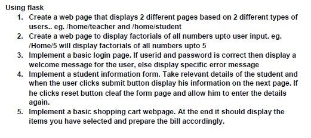

# flask-beginner-examples

- Some beginner examples for Flask, a Python web development framework.
- Some resources to learn Flask can be found [here](https://gist.github.com/HarshKapadia2/e7e13676c83bc295ce78aa7f39611caf).

## **Technologies Used**

- Back end
   - Flask

- Front end
    - HTML

## **Contributions**

- All contributors are most welcome!
- Do view the [`CONTRIBUTING.md`](CONTRIBUTING.md) file for further instructions, requirements/dependencies & local project setup instructions!
- All the amazing contributors to this repo can be found in the [`CONTRIBUTORS.md`](CONTRIBUTORS.md) file!

## **Code of conduct**

- Please view the [`CODE_OF_CONDUCT.md`](CODE_OF_CONDUCT.md) file for details.

## Flask beginner examples

6. <Contributors, add your example gist (summary) here>
